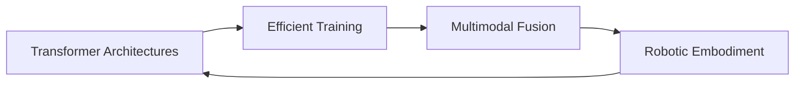

Here's a balanced professional-yet-approachable version with enhanced visuals:

```markdown
# 🌌 Mohammed (Silva) | AI Architect & Robotics Researcher

<div align="center">
  
   <!-- Replace with actual banner image -->

  *"Crafting the neural pathways of tomorrow's intelligent systems"*
  
</div>

---

## 🧬 Technical DNA

| **Domain**          | **Specialties**                                                                 |
|----------------------|---------------------------------------------------------------------------------|
| 🤖 **Core AI**       | Transformers • LLM Training (SFT/RLHF/DPO) • Multimodal Fusion                  |
| 👁️ **Vision**       | Real-Time Detection • Semantic Segmentation • Vision-Language Models            |
| ⚙️ **Systems**      | CUDA Acceleration • ML Pipelines • Robotics Middleware (ROS2)                  |
| 🔬 **Research**      | Efficient Architectures • Neural-Symbolic AI • Embodied Intelligence           |

---

## 🛠️ Tech Stack Arsenal

### **Languages & Frameworks**
<div align="center">
  
  
  
  
  
  

</div>

### **Vision & Robotics**
<div align="center">

  
  
  
  

</div>

---

## 🚀 Featured Projects

### **MyLLM101** | [GitHub](https://github.com/silvaxxx1/MyLLM101)
```python
# The self-aware AI tutor
class MetaBot:
    def __init__(self):
        self.knowledge = "LLM Architecture • Training Cycles • System Design"
        
    def explain(self):
        return "🤖 I understand my own creation!"
```
 <!-- Add pipeline diagram -->

### **SilvaNet** | [GitHub](https://github.com/silvaxxx1/SilvaNet)
```diff
+ NumPy-based DL Framework
- Implements autograd from scratch
+ Used in 3 academic courses
- 500+ GitHub stars
```

---

## 🌟 Current Explorations



---

## 🤝 Let's Build the Future

<div align="center">

[](mailto:silvapi1994@gmail.com)  
[](https://linkedin.com/in/mohammed-sedeg)  
[](https://twitter.com/silva_ai)

</div>

---

<div align="center">
  
  
  
  *"Great systems emerge from the marriage of rigorous engineering and creative vision"*
  
</div>
```


