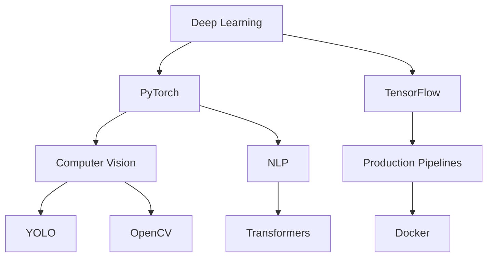

# 🚀 Welcome to My Digital Corner!  

<div align="center">

[](https://github.com/silvaxxx1)
[](https://github.com/silvaxxx1)

</div>

Hi there! I’m **Mohammed (aka Silva)**, a passionate **Deep Learning Specialist** and **System Architect**. Armed with a Bachelor's in Control Systems and Robotics, I’m currently pursuing my **PhD** in **Multimodal Deep Learning and Robotics**. I thrive on building cutting-edge AI systems that push technological boundaries and create real-world impact.  

---

## 🌟 About Me  

As an **AI Developer**, I specialize in creating intelligent systems spanning **Computer Vision**, **Natural Language Processing (NLP)**, and **Robotics**. My expertise lies in:

- 🧠 Designing scalable neural architectures  
- ⚡ Framework optimization & performance tuning  
- 🔍 Low-level network mechanics analysis  
- 🌉 Theory-to-practice implementation bridging  

---

## 💻 Technical Toolkit  

### **Core Technologies**  
<div align="center">



</div>

### **Skill Proficiency**  
<div align="center">

| Technology       | Proficiency   |
|------------------|---------------|
| Python           | ▰▰▰▰▰▰▰▱▱ 70% |
| PyTorch          | ▰▰▰▰▰▰▰▱▱ 70% |
| TensorFlow       | ▰▰▰▰▱▱▱▱▱ 40% |
| CUDA             | ▰▰▱▱▱▱▱▱▱ 20% |
| Computer Vision  | ▰▰▰▰▰▱▱▱▱ 50% |

</div>

---

## 📈 GitHub Activity  

<div align="center">

[](https://github.com/ashutosh00710/github-readme-activity-graph)

[](https://git.io/streak-stats)  
[](https://github.com/anuraghazra/github-readme-stats)

</div>

---

## 📂 Featured Projects  

### **[MyLLM101](https://github.com/silvaxxx1/MyLLM101)**  
  
*LLM lifecycle implementation in PyTorch*

### **[SilvaNet](https://github.com/silvaxxx1/SilvaNet)**  
  
*Educational DL library in NumPy*

### **[PAPER2CODE](https://github.com/silvaxxx1/PAPER2CODE)**  
  
*ML paper implementations*

---

## 🌐 Let’s Connect!  

<div align="center">

[](mailto:silvapi1994@gmail.com)
[](https://www.linkedin.com/in/mohammed-sedeg-67444b307/)
[](https://github.com/silvaxxx1)

</div>

---

<div align="center">
  
🤖 **Did You Know?** My first neural network predicted robot arm trajectories!  
📌 **Visitor Count:** 

</div>
```

**To make this work properly:**

1. **For Project GIF Previews**:
   - Create short (3-5 second) GIFs of your projects
   - Upload them to your project repositories
   - Replace placeholder URLs:
     ```markdown
     
     ```

2. **Skill Proficiency Matrix**:
   - Adjust percentages based on your actual skill level
   - Update progress bars using this format:
     ```markdown
     | Python | ▰▰▰▰▰▰▰▱▱ 70% |
     ```

3. **Tech Stack Tree**:
   - The Mermaid diagram will render automatically on GitHub
   - Modify the structure to match your actual tech relationships

4. **GitHub Activity Cards**:
   - The contribution graph uses your actual commit history
   - Stats update automatically
