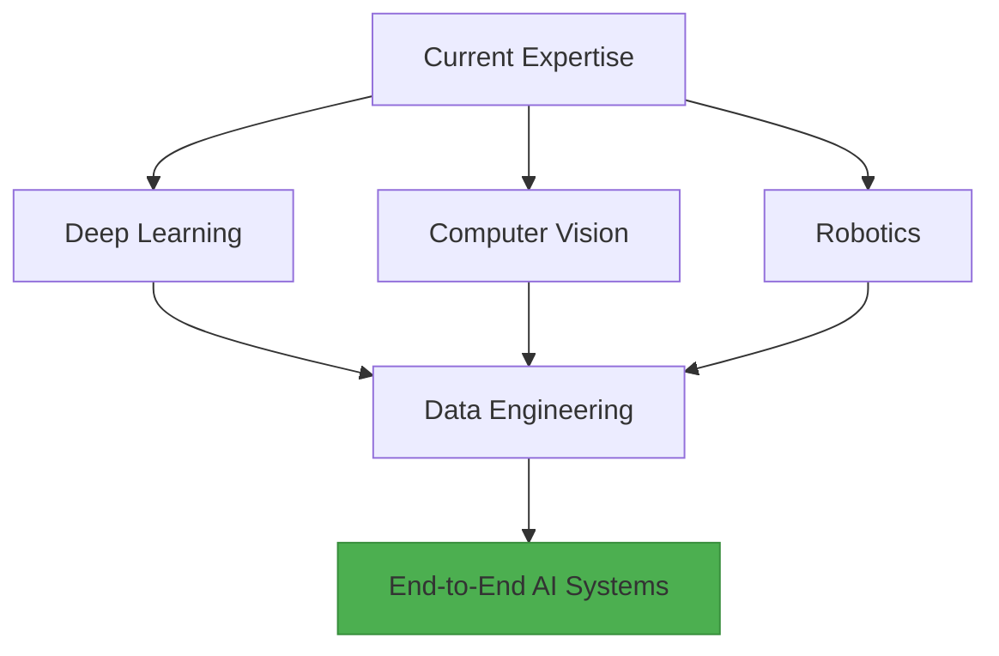

# 🚀 Mohammed (Silva) - Deep Learning Engineer & Systems Architect

<div align="center">
  
   <!-- Replace with actual banner -->

</div>

---

## 🌟 **Core Competencies**

### **Deep Learning Specialization**
 


### **Emerging Expertise** (2024 Focus)
 


---

## 🛠️ **Technical Arsenal**

### **Full-Stack AI Development**
```python
# Complete Model Lifecycle Toolkit
stack = {
    "Model Development": ["PyTorch", "JAX", "HuggingFace"],
    "Optimization": ["CUDA", "Triton", "ONNX"],
    "Data Pipeline": ["Apache Beam", "Spark", "TFX"],
    "Deployment": ["FastAPI", "Triton", "Kubeflow"],
    "Robotics": ["ROS2", "Gazebo", "MoveIt"]
}
```

### **Core Technologies**
<div align="center">
  
  
  
  
  
</div>

---

## 🔭 **2024 Learning Trajectory**



---

## 🏗️ **Featured Projects**

### **1. MyLLM101** [](https://github.com/silvaxxx1/MyLLM101)
*From Scratch LLM Implementation with Self-Aware AI*
```diff
+ Full Training Cycle: Pretraining → SFT → RLHF → DPO
+ Modular Architecture Design
+ Meta_Bot: AI Tutor Understanding Its Architecture
- Technologies: PyTorch • FlashAttention • Triton
```

### **2. Automated Vision Pipeline** [](https://pipeline.demo)
*Industrial-Grade Object Detection System*
```diff
+ 63% Latency Reduction via CUDA Optimizations
+ CI/CD Pipeline for Model Updates
- Tech Stack: TensorFlow • Kubernetes • Prometheus
```

### **3. SilvaNet** [](https://github.com/silvaxxx1/SilvaNet)
*Educational Deep Learning Framework*
```python
# Core Features
class Framework:
    def __init__(self):
        self.autograd = True
        self.distributed = False  # 2024 Goal
        self.optimized = False    # CUDA Integration Planned
```

---

## 🌐 **Connect & Collaborate**

<div align="center">

[](mailto:silvapi1994@gmail.com)  
[](https://linkedin.com/in/mohammed-sedeg)  
[](https://scholar.google.com/silva)

</div>

---

<div align="center">
  
  
  
  *"Engineering intelligent systems requires both microscopic precision and macroscopic vision"*

</div>
```
